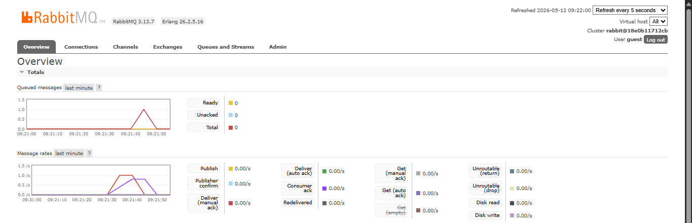

### Reflection

**1. What is AMQP?**

AMQP (Advanced Message Queuing Protocol) adalah protokol standar terbuka (*open standard*) di tingkat aplikasi (*application layer*) yang dirancang khusus untuk *message-oriented middleware*. Secara sederhana, AMQP adalah aturan atau protokol yang mengatur bagaimana pesan (*message*) dikirim, diantrekan (*queuing*), diarahkan (*routing*), dan dijamin keamanannya antar berbagai komponen sistem (seperti *publisher* dan *subscriber*). Pada tutorial ini, protokol inilah yang digunakan oleh RabbitMQ agar layanan kita bisa saling berkomunikasi secara asinkronus dan *reliable*.

**2. What does it mean? `guest:guest@localhost:5672`**

*String* `guest:guest@localhost:5672` adalah sebuah *connection URI* yang digunakan program (baik *publisher* maupun *subscriber*) untuk melakukan autentikasi dan terhubung ke *server* RabbitMQ.
- **first `guest`:** Merupakan *username default* bawaan dari RabbitMQ.
- **second `guest`:** Merupakan *password default* untuk *user* `guest` tersebut.
- **`localhost:5672`:** `localhost` menandakan bahwa *server* RabbitMQ sedang berjalan di mesin/komputer lokal kita sendiri. Sedangkan `5672` adalah *port default* yang dikhususkan oleh RabbitMQ untuk mendengarkan koneksi yang menggunakan protokol AMQP.

### Simulasi Slow Subscriber

Berikut adalah *screenshot* dari *dashboard* RabbitMQ saat simulasi *slow subscriber* berlangsung:

**Mengapa jumlah antrean (queued messages) pada mesin saya hanya mencapai angka 1?**

Pada eksperimen *slow subscriber* ini, saya menambahkan instruksi *delay* (`sleep`) agar *consumer* memproses pesan lebih lambat. Pada grafik *Queued messages* di atas, terlihat puncaknya berada di angka **1**.

Hal ini dapat terjadi karena beberapa faktor waktu (*timing*):
1. *Dashboard* manajemen RabbitMQ memperbarui metriknya berdasarkan interval waktu tertentu (*polling* setiap 5 detik).
2. Grafik menangkap *snapshot* (keadaan sesaat) di mana *publisher* baru saja selesai mengirimkan pesan, dan *subscriber* sedang sibuk memproses pesan sebelumnya, sehingga tepat hanya ada **1 pesan** yang terekam sedang menunggu (mengantre) di dalam *queue* sebelum akhirnya ditarik oleh *subscriber*.