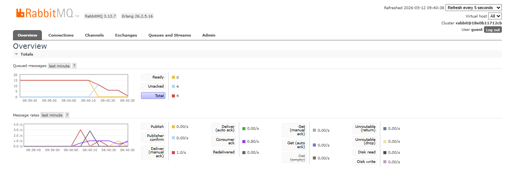
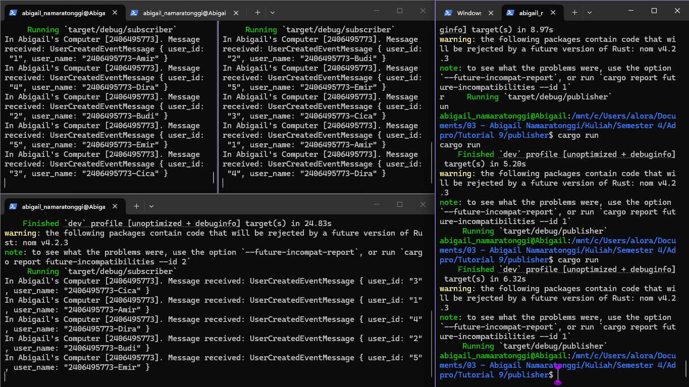
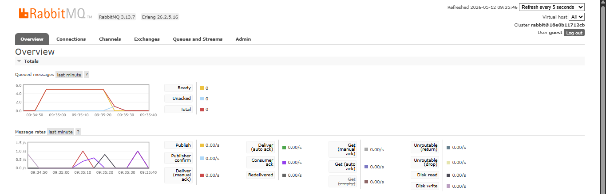

### Reflection

**1. What is AMQP?**

AMQP (Advanced Message Queuing Protocol) adalah protokol standar terbuka (*open standard*) di tingkat aplikasi (*application layer*) yang dirancang khusus untuk *message-oriented middleware*. Secara sederhana, AMQP adalah aturan atau protokol yang mengatur bagaimana pesan (*message*) dikirim, diantrekan (*queuing*), diarahkan (*routing*), dan dijamin keamanannya antar berbagai komponen sistem (seperti *publisher* dan *subscriber*). Pada tutorial ini, protokol inilah yang digunakan oleh RabbitMQ agar layanan kita bisa saling berkomunikasi secara asinkronus dan *reliable*.

**2. What does it mean? `guest:guest@localhost:5672`**

*String* `guest:guest@localhost:5672` adalah sebuah *connection URI* yang digunakan program (baik *publisher* maupun *subscriber*) untuk melakukan autentikasi dan terhubung ke *server* RabbitMQ.
- **first `guest`:** Merupakan *username default* bawaan dari RabbitMQ.
- **second `guest`:** Merupakan *password default* untuk *user* `guest` tersebut.
- **`localhost:5672`:** `localhost` menandakan bahwa *server* RabbitMQ sedang berjalan di mesin/komputer lokal kita sendiri. Sedangkan `5672` adalah *port default* yang dikhususkan oleh RabbitMQ untuk mendengarkan koneksi yang menggunakan protokol AMQP.

### Simulasi Slow Subscriber

Berikut adalah *screenshot* dari *dashboard* RabbitMQ saat simulasi *slow subscriber* berlangsung:

**Mengapa jumlah antrean (queued messages) pada mesin saya hanya mencapai angka 15?**

Pada eksperimen *slow subscriber* ini, saya menambahkan instruksi *delay* (`sleep`) agar *consumer* memproses pesan lebih lambat. Pada grafik *Queued messages* di atas, terlihat antrean memuncak dan tertahan di angka **15**.

Hal ini terjadi karena eksekusi *publisher* yang menembakkan banyak pesan secara berurutan berbanding terbalik dengan kecepatan *subscriber* dalam memprosesnya. Karena hanya ada satu *subscriber* yang berjalan dengan lambat akibat instruksi *delay*, pesan-pesan yang datang secara masif tersebut tidak sanggup ditarik dan diproses secara instan. Akibatnya, pesan-pesan tersebut menumpuk dan menyebabkan *bottleneck* di dalam *queue* RabbitMQ.

### Running Multiple Subscribers (Scaling Out)

Berikut adalah *screenshot* konsol yang menampilkan 3 *subscriber* berjalan bersamaan, serta grafik antrean pada RabbitMQ:

**1. Mengapa lonjakan (spike) antrean pesan turun lebih cepat?**

Pada grafik di atas, terlihat *Queued messages* menjadi **5**. Hal ini terjadi karena kita melakukan *horizontal scaling* dengan menjalankan 3 *subscriber* (pekerja) secara bersamaan.

RabbitMQ mendistribusikan tumpukan pesan tersebut secara paralel menggunakan metode **Round-Robin**. Karena beban kerja kini dibagi rata kepada 3 *subscriber* sekaligus, proses eksekusi menjadi jauh lebih cepat dan antrean pesan di dalam *queue* dapat segera dikosongkan dibandingkan saat hanya mengandalkan satu *subscriber* yang lambat.

**2. Refleksi & Area Peningkatan pada Kode Publisher dan Subscriber:**

Setelah melihat kode implementasinya, terdapat beberapa peningkatan yang bisa diterapkan untuk membuat sistem *message broker* ini lebih tangguh (*robust*):
* **Penerapan Manual Acknowledgement (Ack):** Saat ini, pesan mungkin dianggap selesai (terhapus dari antrean) begitu saja setelah dikirim ke *subscriber* (*auto-ack*). Idealnya, *subscriber* harus mengirimkan sinyal *manual ack* **hanya setelah** proses di dalamnya benar-benar selesai. Jika *subscriber* mati (crash) di tengah proses pemrosesan, pesan tidak akan hilang dan akan dikembalikan (*requeued*) untuk ditugaskan ke *subscriber* lain.
* **Konfigurasi Prefetch Count (QoS = 1):** Kita perlu mengatur *prefetch count* menjadi 1 pada *subscriber*. Ini memastikan RabbitMQ tidak mendistribusikan pesan baru ke sebuah *subscriber* jika *subscriber* tersebut masih sibuk bekerja (belum memberikan *ack*), sehingga pembagian beban kerja antar *subscriber* menjadi jauh lebih adil.